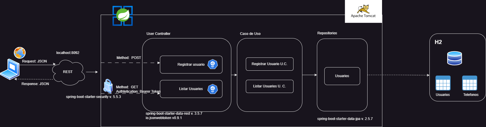

# Reto técnico creacion de usuarios

## Ejecutar Proyecto
  ### Variables de Entorno:

| Variable                      | Descripcion                                                     |                                    valor                                    |
|-------------------------------|-----------------------------------------------------------------|:---------------------------------------------------------------------------:|
| server.port                   | puerto donde corre la app                                       |                                    8092                                     |
| application.client.api.path   | url base de los servicios                                       |                                 /channel/v1                                 |
| user.domain.pattern           | expresion regular que se usa para la validaciones de correo     |                             ^(.+)@(domain.cl)$                              |
| user.domain.error-format      | mensaje cuando el formato no es valido                          |        El correo debe seguir el siguiente formato: example@domain.cl        |
| user.domain.error-email-exist | mensaje cuando el correo ya existe                              |                    EL correo ya existe, use otro correo.                    |
| user.password.pattern         | expresion regular que se usa para la validaciones de contrasela |                  ^(?=.*\\d){2}(?=.*[a-z])(?=.*[A-Z]).{4,}$                  |
| user.password.error-format    | mensaje cuando la contraseña es incorrecta                      | Contraseña inválida, debe contener una Mayúscula, minúsculas y dos números  |


### Prerequisitos:
``` 
Supongamos que ya tienes Git, JDK y Gradle Wrapper instalados.
``` 

### Comandos

clonar el proyecto:
``` 
  git clone https://github.com/sleonr0792/sermaluc-challenge.git
```
entrar a la carpeta raiz del proyecto:
```
 cd  sermaluc-challenge
```

para descargar las dependencias:
```
./gradlew build
```

para ejecutar el proyecto:

```
./gradlew bootRun
```

Para ejecutar las pruebas:
```
./gradlew test
```

para ejecutar una prueba específica:
```
./gradlew test --tests "com.challenge.sermaluc.domain.usercase"
```


## Swagger: [Documentación](http://localhost:8092/swagger-ui-custom.html)
- Link: http://localhost:8092/swagger-ui-custom.html
## Servicios:

### Registrar Usuario: servicio para registrar servicios
- Servicio: api/v1/users
-  Metodo: POST
- Request:
  ``` json
      {
      "name": string,
      "email": string,
      "password":string",
      "phoneResponse":[
          {
          "number":string,
          "citycode":string,
          "contrycode":string
          }
       ]
      }
  ```
- Response:
  ``` json
      {
  "id": string,
  "name": string,
  "email": string,
  "token": string,
  "registered": Date,
  "updated":Date,
  "lastLogin":Date,
  "phoneResponse": [
      {
          "number": string,
          "citycode": string,
          "contrycode": string
      }
  ],
  "state": string
   ```


### Listar Usuarios:

- Servicio: api/v1/users/list
- Metodo: GET
-  Authorization: Bearer JWT
- Request:
  ``` json
       
  ```
  - Response
    ``` json
    [ 
        {
            "id": string,
            "name": string,
            "email": string,
            "token": string,
            "registered": Date,
            "updated":Date,
            "lastLogin":Date,
            "phoneResponse": [
                {
                    "number": string,
                    "citycode": string,
                    "contrycode": string
                }
            ],
            "state": string
        }
    ]
    ```

### Diagrama de la solucion:

